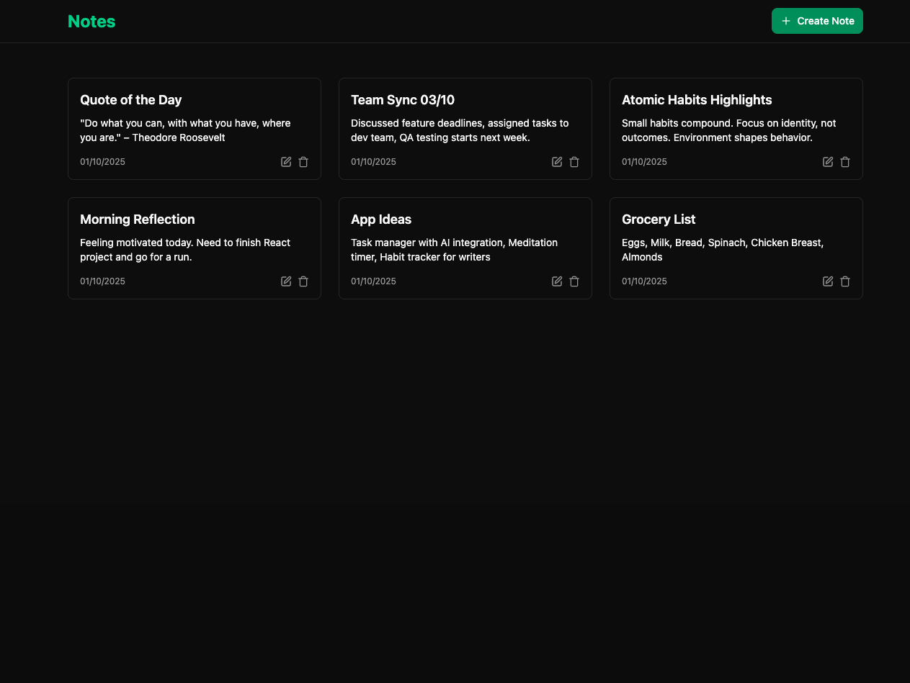

# Notes App - MERN Stack

This is a note-taking application built with the MERN stack (MongoDB, Express, React, Node.js). It allows users to create, read, update, and delete notes in a user-friendly interface.

## Built With

- Node
- Express
- MongoDB
- React
- Tailwind CSS
- Shadcn UI
- Vite
- PNPM
- TypeScript
- Mongoose
- React Router
- React Query
- React Hook Form
- Zod

## Features

- Create, read, update, and delete notes
- Rate limiting to prevent abuse
- Responsive design for mobile and desktop

## Installation

1. Clone the repository

2. Install the dependencies

```bash
npm install
```

3. Set up the environment variables in /client and /server

4. Start the server and client

```bash
npm run dev
```

## Docker Instructions

To run with docker compose, follow these steps:

1. Build and start the Docker containers

```bash
docker compose up --build
```

Alternatively, follow these steps:

1. Build the Docker images

```bash
docker build -t notes-app .
```

2. Start the Docker containers

```bash
docker run -d -p 4000:4000 notes-app
```

## Screenshots


